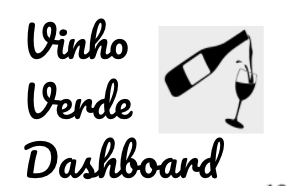
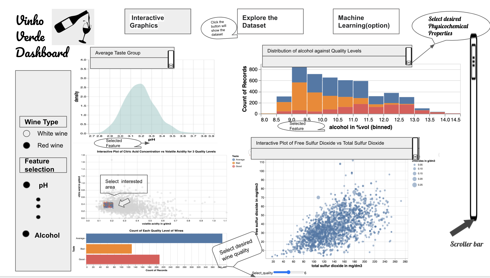

# **Wine Vision App**  
***Discover the physiochemical secrets to what makes a wine wonderful...***

*You can visit the app directly by clicking here* &rarr; &rarr; &rarr; [***Wine Vision***](https://wine-vision.herokuapp.com/)

## Welcome!
:confetti_ball::balloon::confetti_ball::balloon: Hello and thank you for stopping by the [Wine Vision App](https://wine-vision.herokuapp.com/)! :confetti_ball::balloon::confetti_ball::balloon:

This page is our homebase providing you information on the project. 
Navigate directly to a section of your choice or scroll down to find out more.

* [What are we doing? (And why?)](#what-are-we-doing)
* [Describing the App](#app-description)
* [App Sketch](#app-sketch)
* [Describing the Data](#the-data)
* [A Fun Usage Scenario](#a-fun-usage-scenario)
* [So who are we?](#who-are-we)
* [Want to get involved?](#get-involved)
* [Get in touch](#contact-us)
* [And thank you to our data source!](#data-citation)

## What are we doing?
### The problem
Wine making has always been a traditional practice passed down for many generations; yet, some of wine's secrets are still a mystery to most people, even wine producers! So how are we supposed to craft the perfect wine without knowing what makes it perfect (speaking from both a consumer and business perspective)?

In general, wine quality evaluation is assessed by physicochemical tests and sensory analys. It's the roadmap to improving a wine. However the relationship between physicochemical structure and subjective quality is complex and no individual component can be used to accurately predict a wine’s quality. The interactions are as important as the components themselves. 

From a business perspective, producers are constantly looking for ways to outperform the competition by creating the best wine they can. Those who understand the fundamental physiochemical aspects of wine will have a greater edge into crafting an enjoyable and profitable product. So, we introduce to you the *Wine Vision Dashboard*.

### The solution
**Our interactive dashboard will allow users to explore a number of physicochemical variables and how they interact to determine the subjective quality of a wine. Our visualizations will allow users to test and discover for themselves these relationships.** Wine producers, wine enthusiasts, and curious individuals can all make use of this dashboard.

 

## App Description
The Vinho Verde wine Dashboard has three tabs; Interactive Graphics, Explore the Dataset and Machine Learning.

The Interactive Graphics page contains a number of graphis to explore the effects of physicochemical properties on wine quality. On the left hand side users are able to select the wine type (eg. red wine, white wine) as well as the physicochemical features of interest, with subset ranges if they so desire. Some possible visualizations are as follows:

- Variable density distributions for each quality category comparing red vs white.
- Stacked distribution of variable counts in each quality factor.
- Scatterplot with interactive slide bar for the quality label and dropdown for property to plot against. This plot will also allow users to select a specific area and generate a bar plot demonstrating the quality distribution in this range.
- Scatterplot to plot any two physicochemical properties against each other.

The Explore the Dataset tab will focus on descriptive data analysis, allowing users to generate summary statistics for groups of their choice. Users will also be able to sample raw data for a closer look at the numbers.

Lastly, the Machine learning tab will focus on modelling and machine learning techniques. This section will be primitive in the early stage of the project, and will likely just include simple linear regression for now. We plan to expand this section when we do the project in R.

## App Sketch

## The Data
Portugal is second in the world for per-capita wine consumption [2](https://www.nationmaster.com/nmx/ranking/wine-consumption-per-capita) and eleventh for wine production [3](https://en.wikipedia.org/wiki/List_of_wine-producing_regions), so by no coincidence we built our dashboard on the famous Portuguese wine quality data set from Cortez et al., 2009. 

Data was collected from Vinho Verde wines originating from the northwest regions of Portugal. These wines have a medium alcohol content, and are particularly sought for their freshness in summer months. Each wine sample was evaluated by at least three sensory assessors (using blind tastes) who graded the wine from 0 (worst) to 10 (best). The final quality score is given by the median of these evaluations.

The dataset consists of the physiochemical composition and sensory test results for 4898 white and 1599 red wine samples which were collected from May 2004 to February 2007. Each wine sample contains 12 variables that provide the acidity properties (fixed acidity, volatile acidity, citric acid, pH), sulphides contents (free sulfur dioxide, total sulfur dioxide, sulphates), density related properties (residual sugar, alcohol, density), and salt content (chlorides). It also contains quality as the response variable. In order to improve classification analyses, we define a new variable, quality_factor. Any wine with a quality score less than six is classified as “below average”, a score of 6 is “average”, and above 6 is “above average”.

## A Fun Usage Scenario
Alice is a winemaker in BC’s Okanagan Valley. She would like to create a new summer wine and hopes to take inspiration from the Vinho Verde wines, known for their refreshing qualities. Alice seeks our dashboard to better understand what wine attributes she should focus on to provide a tasting experience comparable to the very best Vinho Verde wines. However, there are some physicochemical properties she has little control over due to the soils and grape species available to her. Due to the above average alkalinity of Okanagan soil, she knows that her wines will typically be less acidic than true Vinho Verde wines, and the altitude means the chloride content will be lower as well. She wants to try to optimize the variables she has control over to make the best wine possible. She looks to our dashboard to see how Vinho Verde wines with higher pH and lower chloride content tend to fare. Looking at the interactive scatterplots, she sees that wines which have values within her possible ranges for these variables tend to be of very poor quality when they are also high in residual sugar, but less sweet wines are of good quality. She then consults the histograms and sees that there are not very many wines available that have these properties, so she knows that she will not have much direct competition should she go forward with this design. A few years later, she released this wine to broad critical acclaim and millions in profit.

## Who are we?
At heart, we are Okanagan wine enthusiasts (but when we're not drinking wine we're graduate students at the University of British Columbia). 

## Get involved
If you think you can help in any of the areas listed above (and we bet you can) or in any of the many areas that we haven't yet thought of (and here we're *sure* you can) then please check out our [contributors' guidelines](CONTRIBUTING.md) and our [roadmap](../../issues/1).

Please note that it's very important to us that we maintain a positive and supportive environment for everyone who wants to participate. When you join us we ask that you follow our [code of conduct](CODE_OF_CONDUCT.md) in all interactions both on and offline.

## Contact us
If you want to report a problem or suggest an enhancement we'd love for you to [open an issue](../../issues) at this github repository because then we can get right on it.

## Data Citation
Paulo Cortez, University of Minho, Guimarães, Portugal, http://www3.dsi.uminho.pt/pcortez
A. Cerdeira, F. Almeida, T. Matos and J. Reis, Viticulture Commission of the Vinho Verde Region(CVRVV), Porto, Portugal
@2009
